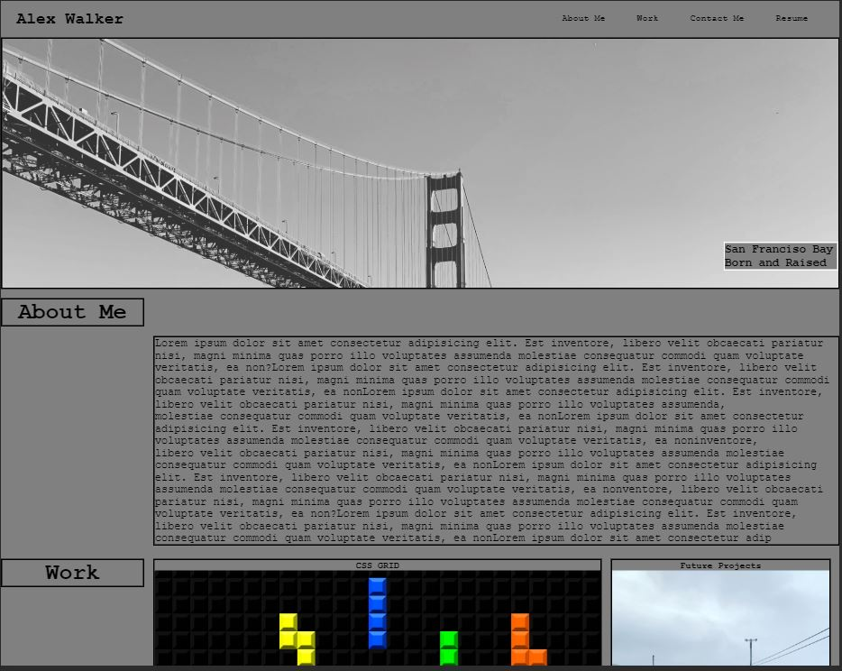

# My Portfolio

## Project Description:
* CSS Grid was used for the webpage layout. In order to control the child grid elements I had to change the minmax to 25% to control the grid auto rows function. 
* I took care to nest all of my child elements with their own children divs/span elements.
* Text image overlays are nested inside Span elements in order to control it's orienatation inside parent div however it was still difficult to align properly without affecting surrounding grid children. 
* I used  flexbox primarily for all Span elements however still proved difficult to implement.
* Any image without flexbox was positioned by margin yet ran off the screen when minimized, i.e. hero placeholder text. A quick fix was to just set left margin 0. 
* @media queries are listed however does not initialize well due to CSS grid children auto formatting  during screen size changes.
* Used Psuedo Selector for nav ul li hover animation. 
* All work images are placeholders only. There are no live links to any deployed projects.
* Additionally I was concerned that combining ID and Class Attributes would cause errors however it worked well for anchor tags in my nav element to link to internal content.

## Link to Portfolio 
* https://walker-walker.github.io/Portfolio-/

## Link to Github Repo
* https://github.com/Walker-Walker/challenge-2.git

